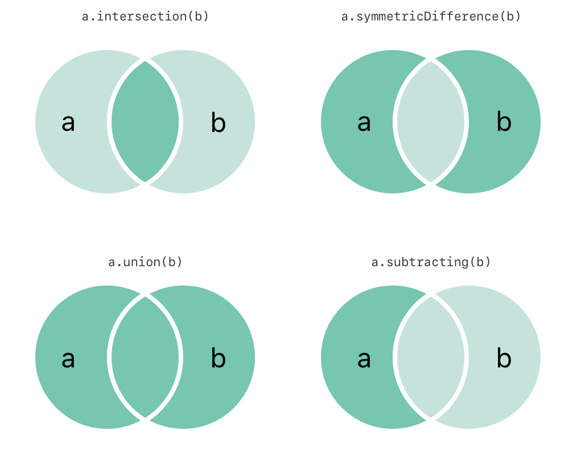

#  Tietojoukot (Set)

Tämä demo on tarkoitettu Tietojenkäsittelytieteiden koulutusohjelman kurssien oppimateriaaliksi. Alkuosa tästä tekstistä sopii luettavaksi perusohjelmointikokemuksella, teknisen toteutuksen yksityiskohdat ja koodidemo taas on tähdätty Tietorakenteet ja algoritmit -kurssin opiskelijoille.

Materiaali olettaa että tunnet jo ehto- ja toistorakenteet (`if`, `switch-case`, `for`, `while`, `do-while`) ja sen miten Boolen algebraa niissä käytetään (totuuslauseet ja boolen algebran perusoperaatiot AND, OR, NOT). Näitä käydään läpi sekä Laitteet ja tietoverkot että Ohjelmointi 1 -kursseilla.

Tässä demossa käsitellään tietojoukko -tietorakenteita (`Set`). Peruskoulujen ja lukioiden opetussuunnitelmasta joukko-oppi poistettiin 2004. Tietojenkäsittelytieteiden koulutusohjelmassa oli vielä vuoteen 2018 saakka kurssi Diskreetit rakenteet, jossa käsiteltiin (myös) joukko-oppia ohjelmoinnin näkökulmasta. Tämän jälkeen aihetta on on käyty läpi enemmän tai vähemmän hajautuneesti muilla koulutusohjelman peruskursseilla.

Koska näitä taustatietoja joukko-opista ei enää opiskelijoilla tyypillisesti ole, siksi tämä perusoppimateriaali ja demo aiheesta. Joukko-opin perusteiden hallinta todennäköisesti auttaa ymmärtämään paitsi ehto- ja toistorakenteiden loogisia ehtoja, myös ymmärtämään tietojoukkoja, niiden toimintaa ja toteutusta. 

Joukko oppi on olennainen osa tietojenkäsittelyä. Esimerkiksi  englanninkielisessä [wikipedia-artikkelissa](https://en.wikipedia.org/wiki/Set_theory), todetaan:

> Set theory is used to introduce students to logical operators (NOT, AND, OR), and semantic or rule description [...] of sets (e.g. "months starting with the letter A"), which may be useful when learning computer programming, since Boolean logic is used in various programming languages. Likewise, sets and other collection-like objects, such as multisets and lists, are common datatypes in computer science and programming.

Materiaali on aika lyhyt, ja sisältää vain ohjelmoinnin kannalta olennaiset perusteet joukko-opista, ohjelmoinnin näkökulmasta. Lisätietoja saat lopussa listatuista lähteistä ja kirjallisuudesta.
 

## Tietojoukot ja joukko-oppi

Tietojoukot (`Set`) ovat ohjemoinnissa äärellisiä tietoalkiokokoelmia (*container*) joissa:

- tietoelementit (alkiot) eivät ole joukossa missään tietyssä järjestyksessä ja
- tietoelementti voi esiintyä tietojoukossa vain kerran

Matematiikassa (joukko-oppi on matematiikan osa-alue) tietojoukot voivat olla äärettömiä, esimerkiksi kaikkien positiivisten kokonaislukujen joukko. Tietokoneissa lukuarvoilla on kuitenkin äärelliset arvot, riippuen käytetyistä tietotyypeistä ja tietokoneen prosessorin arkkitehtuurista. Tietojoukot eivät voi olla äärettömiä siksikään että tietokoneiden muisti on rajallista.


## Perusteet 

Esimerkkinä tietojoukosta esimerkiksi joukko:

```
{2, 4, 6, 8, 10}
```

Jossa on viisi parillista kokonaislukua. Vaikka esimerkissä yllä numerot ovat suuruusjärjestyksessä (joukoissa elementtien järjestyksellä ei ollut väliä), se johtuu vain siitä, että numerot on kirjoitettu tähän näin.

Siksi nämä kaksi joukkoa...:

```
{2, 4, 6, 8, 10}
{4, 10, 8, 6, 2}
```

...ovat joukko-opin näkökulmasta "yhtäsuuria", eli sama joukko. Niissä on sama määrä elementtejä, ja elementit ovat samoja. 

Toinen esimerkki:

```
{"Toyota", "BMW", "Audi", "Volkswage", "Porsche"}
```

Tämä joukko sisältää viisi autovalmistajan nimeä, merkkijonoina, ei missään erityisessä järjestyksessä.

Jos esimerkin kokonaislukujoukkoon yritettäisiin lisätä elementti arvoltaan `4`, joukon koko tai sisältö ei muuttuisi, sillä kyseinen arvo on jo joukossa.

Ohjelmoinnissa tietojoukot ovat hyödyllinen käsite, sillä joukko-oppi -ajattelu helpottaa esimerkiksi ihan yksinkertaistenkin ehtolauseiden rakentamista.

Esimerkkinä asiakasohjelma (client) joka tekee webbipalvelimelle (server) pyynnön jonkun tiedon hakemiseksi HTTP -protokollalla:

```Java
    int returnCode = httpClient.executeRequest(request);
```

Tässä `httpClient` on olio-ohjelmoinnin olio (`object`) joka lähettää palvelupyynnön kutsumalla metodia (funktiota) (`executeRequest`) palvelimelle HTTP-protokollaa käyttäen. Kun palvelin vastaa, metodi palauttaa kokonaisluvun joka kertoo miten pyynnön suorittamisen kanssa kävi. Kokonaisluku tulee palvelimelta asiakasohjelmalle joka tallentaa koodin `returnCode` -muuttujaan.

HTTP [määrittelee](https://en.wikipedia.org/wiki/List_of_HTTP_status_codes) pyynnöille numeerisen kokonaislukukoodin, joka kertoo onnistuiko pyyntö vai ei, esimerkiksi:

* Jos koodi on jotain arvoalueelta 200...299, pyyntö onnistui. 
* Jos koodi on taas jotain 400 -alkuista, palvelin ilmaisee sillä että pyynnössä oli jotain vikaa. 
* Koodi 5xx -arvoalueella taas tarkoittaa että palvelimen puolella joku meni pieleen.

Arvoalueet määrittelevät siis tavallaan kategorian tai luokan -- **joukkoja** kokonaislukuja. Joku tietty arvo joukon sisällä kertoo tarkemmin miten pyyntö saatiin suoritettua, tai jos ei saatu, mikä täsmälleen se virhe oli. 

> Esimerkiksi arvo `204` (No Content) sisältyy joukkoon 200...299 eli pyyntö onnistui, kaikki meni hyvin. Täsmällinen arvo taas kertoo, että palvelin ei lähettänyt mitään dataa asiakasohjelmalle käsiteltäväksi, joten tämä datan käsittely voidaan asiakasohjelman koodissa jättää tässä tilanteessa tekemättä.

Client voi sitten tarkistaa, onnistuiko pyynnön suorittaminen vai ei, ennenkuin se edes yrittää käsitellä palvelimen mahdollisesti koodin mukana lähettämää dataa:

```Java
   int returnCode = httpClient.executeRequest(request);
   if (returnCode >= 200 && returnCode < 300) {
      // Kaikki ok, prosessoi data jos sellaista tuli...
   } else if (returnCode >= 400 && returnCode < 500) {
      // Jotain vikaa tässä päässä, käsittele virhetilanne jotenkin
	...
}
```

Eli tiedämme että paluukoodin mahdolliset arvot muodostavat **joukkoja** erilaisia arvoja. Clientin puolella voidaan sitten tarkistaa **mihin joukkoon** paluukoodin arvo sisältyy, ja käsitellä sitten sen mukaan vastaus palvelimelta:

Yllä esimerkissä ei varsinaisesti hyödynnetty tietojoukko -tietorakenteita, mutta sama joukkojen *käsite* tässäkin on käytössä.

Ehtolauseet, joissa on usein loogisia ehtoja, soveltuvat Boolen logiikan lait (käsitelty kurssilla Laitteet ja tietoverkot!). Boolen logiikan tai algebran ja joukko-opin perussäännöt muistuttavatkin huomattavasti toisiaan, jos niitä tarkemmin [lähdet tutkimaan](https://fi.wikipedia.org/wiki/Boolen_algebra#Boolen_algebran_läheinen_yhteys_joukko-oppiin).

Summa summarum: joukko-opin perusteiden tunteminen auttaa usein rakentamaan ehto- ja toistolauseita siten että ne toimivat oikeellisesti.


## Mitä tietojoukoilla voi tehdä?

Yksinkertaisimmillaan tietojoukkoa eli `Set` -tietorakennetta voi hyödyntää siihen, että pidetään sen avulla yllä kokoelmaa tietoelementtejä, varmistuen siitä että joukossa ei varmasti ole kahta kertaa samaa oliota (miten "samuus" eli yhtäsuuruus määritellään, siitä alempana). Joukkoon vain lisätään elementtejä, ja sitten niitä sieltä voidaan hakea ja käyttää, mihin sovellus niitä tarvitseekaan.

Jos tähän käytettäisiin tavallisia taulukoita (*array*), meidän pitäisi itse toteuttaa taulukkoa käsittelevä koodi joka varmistaa ettei elementti ole jo taulukossa, ja lisätä se sinne vasta jos se elementti ei ole jo taulukossa. Set -tietorakenteet tekevät tämän "automaattisesti". Alempana katsotaan miten tämä toteutetaan, sillä jokun toteuttamaa koodiahan tämäkin vaatii.

`Set` -tietorakenteilla voidaan siis toteutuksesta riippuen tehdä sellaisiakin asioita joita joukko-opissa yleisesti käytetään. Näistä lisää seuraavaksi.


## Tietojoukon olennaiset operaatiot

Usein tarvittavia joukkojen perusoperaatioita on listattu alla. Näille operaatioille on tässä annettu joku tietty nimi, mutta eri ohjelmointikielten eri toteutuksissa metodien nimet tietysti vaihtelevat. 

* **lisäys** `insert` tai `add` -lisätään elementti tietojoukkoon. Jos joukossa on jo täsmälleen sama elementti, lisäystä ei tehdä. Usein tämä operaatio palauttaa arvon, joka kertoo tehtiinkö lisäystä vai ei.
* **sisältää** `contains` - testataan onko joku tietty elementti tietojoukossa.
* **yhtäsuuruus** `equals` - testataan onko kahdessa tietojoukossa täsmälleen samat elementit.
* onko tietojoukko **tyhjä joukko** `isEmpty` -- testataan onko joukossa yhtään elementtiä.
* elementtien **määrä** (*count*) `count, size` tietojoukossa -- kertoo kuinka monta elementtiä joukossa on.

Olennaiset joukkoihin liittyvät operaatiot näkyvät havainnollisesti tästä kuvasta (lähteenä Swift Programming Language Book, kts. lähteet lopussa):



Operaatioita ovat siis seuraavat:

* **leikkaus** (*intersection*) -- kahden joukon leikkaus sisältää *molemmissa* joukoissa olevat, yhteiset elementit. Esimerkiksi joukkojen {1, 2, 3} ja {2, 3, 4} leikkaus on joukko {2, 3}.
* **symmetrinen erotus** (*symmetric difference*) -- kahden joukon ne elementit, jotka *eivät ole* molemmissa joukoissa (eli ovat vain jommassa kummassa joukossa). Esimerkiksi, joukkojen {1, 2, 3} ja {2, 3, 4} symmetrinen erotus on joukko {1, 4}.
* **unioni** (*union*) -- kahden joukon elementit yhdistettynä. Jos molemmissa joukoissa oli samoja elementtejä, ne esiintyvät unionissa vain kerran. Esimerkiksi joukkojen {1, 2, 3} ja {2, 3, 4} unioni on joukko {1, 2, 3, 4}.
* **joukkoerotus** (*set difference*, kuvassa *substracting*) -- Joukon A ne elementit, jotka eivät ole joukossa B. Esimerkiksi joukkojen {1, 2, 3} ja {2, 3, 4} joukkoerotus on joukko {1}.

> Englanninkielinen sana *substract* tarkoittaa vähentämistä, eli erotusta.

Lisäksi `Set` toteuttaa usein metodeja joilla voidaan kysyä kahden joukon välisiä suhteita:

* **osajoukko** `isSubset` -- testataan onko tietojoukko A osajoukko tietojoukosta B. Esimerkiksi, joukko {1, 2, 3} on osajoukko joukosta {0, 1, 2, 3, 4}. Jokainen joukko on siis myös itsensä osajoukko.
* **aito osajoukko** (*proper subset, strict subset*) on sellainen, jossa on osa toisen joukon elementeistä, muttei kaikkia (joukot eivät siis ole yhtäsuuria).
* **yläjoukko** (*superset*) `isSuperset` -- osajoukon "käänteinen" versio, testataan, onko tietojoukko A sellainen että se sisältää kaikki tietojoukon B elementit. Esimerkkinä, joukko {5, 6, 7, 8} on yläjoukko joukolle {6, 8}.
* **aito yläjoukko** (*proper superset, strict superset*) `isStrictSuperset` kuten yläjoukko, mutta niin että joukot eivät ole yhtäsuuria.
* **erillisyys** (*disjoint*) `isDisjoint` -- testataan, ovatko joukot erilliset, siten että joukoissa ei ole yhtään yhteistä elementtiä.

Tässä joukko-opin teoreettiset perusteet ohjelmoinnin näkökulmasta. Tästä eteenpäin käsitellään sitä miten `Set` -tietorakenteiden toteutus etenee. Tämä osuus edellyttää Tietorakenteet ja algoritmit -kurssin hajautustaulu -tietorakenteen tuntemista.


## Set:n toteutuksen perusteista

Javan `Set` -rajapinnan [dokumentaatio](https://docs.oracle.com/javase/8/docs/api/java/util/Set.html) kertoo mitä Javan `Set` -tietorakenteilla voidaan tehdä.

Javan toteutus on kuitenkin aika suppea, eikä toteuta läheskään kaikkia yllä mainittuja tietojoukkojen operaatioita. Siksi tässä demossa käytetäänkin [Swiftin Set -tietorakennetta](https://developer.apple.com/documentation/swift/set), koska se sisältää kaikki yllä luetellut tietojoukkojen olennaiset operaatiot.

`Set`:t ovat usein erittäin nopeita tietorakenteita. Niitä **ei** siis ole toteutettu yllä kuvatulla tavalla taulukoilla, siten että uutta elementtiä lisätessä käydään aina **koko** taulukko läpi ja katsotaan onko elementti jo taulukossa. Tämä olisi erittäin hidas tapa, kun tietoaineistojen koko kasvaa suureksi.

Taulukot ovat kuitenkin usein `Set`:ien toteutuksessa käytetty tietorakenne. Toteutukset hyödyntävätkin **hajautusavaimia** eli tiivisteitä (*hash*), eli ovat samankaltaisia toteutukseltaan, kuin **hajautustaulut** (*hash table*). Tässä oletetaan että tunnet jo hajautustaulun perusteet, esim. sen miten törmäykset (*collisions*) hoidetaan esimerkiksi luotaamalla (*probing*).

> Toinen mahdollisuus on toteuttaa `Set` hyödyntäen puutietorakenteita (*tree*), esim. Javan `TreeSet`.

Javassa (taulukkopohjaisessa) toteutuksessa hyödynnetään sitä että kaikilla luokilla on metodi `hashCode()` jolla voidaan laskea elementille tiiviste (*hash*). Jokainen oman luokan toteuttava koodari huolehtii siitä, että luokalla on:

1. hyvä hajautusfunktion toteutus `hashCode()` -metodissa,
2. siten että noudatetaan Javan perussääntöä että luokan `equals()` ja `hashCode()` käyttävät luokan samoja ominaisuuksia (jäsenmuuttujia) yhtäsuuruuden arvioinnissa ja tiivisteen toteuttamisessa.   

Monissa muissakin ohjelmointikielissä on sama periaate --  olion *identiteetti*, se miten olio voidaan erottaa toisista olioista, usein tiettyjen (yhden tai useamman) jäsenmuuttujien arvojen perusteella, vaikuttaa siihen miten nämä kaksi metodia toteutetaan. Molemmat metodit tulisi (yleensä) toteuttaa niin että metodit hyödyntävä samoja jäsenmuuttujia -- olion identiteetin määrääviä tietoja. 

> Esimerkkinä vaikkapa valtionhallinnon tietojärjestelmä jossa kansalainen tunnistetaan yksikäsitteisesti *henkilötunnuksen* avulla. Se määrittää kansalaisen identiteetin yksikäsitteisesti. Tällöin `Citizen` -luokan `equals` vertailee kahden kansalaisolion henkilötunnus -jäsenmuuttujien yhtäsuuruutta, ja `hashCode()` laskee tiivisteen henkilötunnus -jäsenmuuttujasta. Molemmat käyttävät samaa jäsenmuuttujaa.

Swift -ohjelmointikielessä taas tietoelementin on toteutettava `Hashable` ja `Equatable`-rajapinnat. Näissä toteutetaan tiivisteen laskenta sekä yhtäsuuruuden määrittely. Demossa tästä lisää.

Miten `Set` sitten esimerkiksi elementtiä lisätessä tietää onko joukossa jo tämä kyseinen elementti?

1. `Set` laskee ensin oliolle tiivisteen (*hash*).
2. Tiivisteestä luodaan indeksi `Set`:n sisäiseen taulukkoon (kuten hajautustaulussakin).
3. Jos taulukon indeksissä ei ole mitään, tiedetään että samanlaista elementtiä ei ole jo tietojoukossa, joten lisätään se tähän taulukon indeksiin. Usein palautetaan kutsujalle myös arvo joka kertoo että lisäys suoritettiin.
4. Jos taas taulukon indeksissä oli joku elementti, katsotaan onko se sama kuin lisättävä, käyttäen elementin `equals` operaatiota.
5. Jos elementti oli sama, sitä ei lisätä uudestaan, usein palautetaan arvo joka kertoo kutsujalle ettei lisäystä tehty.
6. Jos taas askeleen 4 elementti oli joku muu elementti joka vain sattui tulemaan samaan indeksiin kuin lisättäväkin olisi mennyt, hoidetaan tämä törmäys (*collision*) esimerkiksi luotaamalla (*probing*), siten että *eri* elementti, joka sattui saamaan toisen eri elementin indeksin, voidaan lisätä jonnekin toiseen indeksiin.

Samaa periaatetta käytetään myös tutkiessa onko joku tietty elementti `Set`:ssä. Elementtien läpikäynti tietojoukossa toteutetaan taas usein *iteraattoreiden* avulla. Iteraattorit mahdollistavat tietojoukon elementtien läpikäynnin tyypillisen näköisessä `for` -silmukassa:

```Java
   for (Integer value : theSet) {
     print("Value is: " + value);
	}
```
Iteraattoreista ei tässä kuitenkaan enempää.

Kuten hajautustauluissakin, niin myös `Set`:n hyödyntämisessä on olennaista, että tietoelementtiin toteutettu hajautusfunktio on hyvä. Huono hajautusfunktio tuottaa eri elementeille samoja tiivisteitä, jolloin törmäyksiä syntyy paljon, ja `Set`:n toiminta hidastuu, jos aineiston koko kasvaa suureksi.

Tehokkuus saadaan siis aikaan yhteispelillä -- `Set`:n toteuttaja tekee hyvän ja tehokkaan tietorakenteen törmäystenkäsittelytekniikoineen, ja tietoelementtien koodarit toteuttavat omaan tietoelementtiinsa niin hyvän hajautusfunktion kun vaan pystyvät.


## Demo

Opettajan esittämässä demossa (kurssilla Tietorakenteet ja algoritmit) käydään läpi näitä joukkojen operaatioita, siten kun ne on valmiiksi toteutettuna Swiftin `Set` -tietorakenteessa.

Demon lähdekoodi löytyy alihakemistosta `SetDemo`. Huomaa että osa koodista demossa on kommentoituna, tarkoitus on että opettaja demossaan poistaa kommentit askel askeleelta ja kertoo mitä tapahtuu ja miksi.


# Lähteet

* https://fi.wikipedia.org/wiki/Joukko-oppi
* https://fi.wikipedia.org/wiki/Luokka:Joukko-oppi
* https://en.wikipedia.org/wiki/Set_theory
* https://fi.wikipedia.org/wiki/Boolen_algebra#Boolen_algebran_läheinen_yhteys_joukko-oppiin
* https://docs.swift.org/swift-book/documentation/the-swift-programming-language/collectiontypes/#Sets
* https://developer.apple.com/documentation/swift/set

# Kuka tämän teki?

(c) Antti Juustila, 2024
INTERACT -tutkimusyksikkö, Tietojenkäsittelytieteiden koulutusohjelma, Oulun yliopisto.


Käytetyt lähteet:

* Wikipedian joukkojen termien kuvaukset ja esimerkit: Creative Commons Attribution/Share-Alike -lisenssi.
* Swift -kirjan kuva: Creative Commons Attribution 4.0 International (CC BY 4.0) License. 
